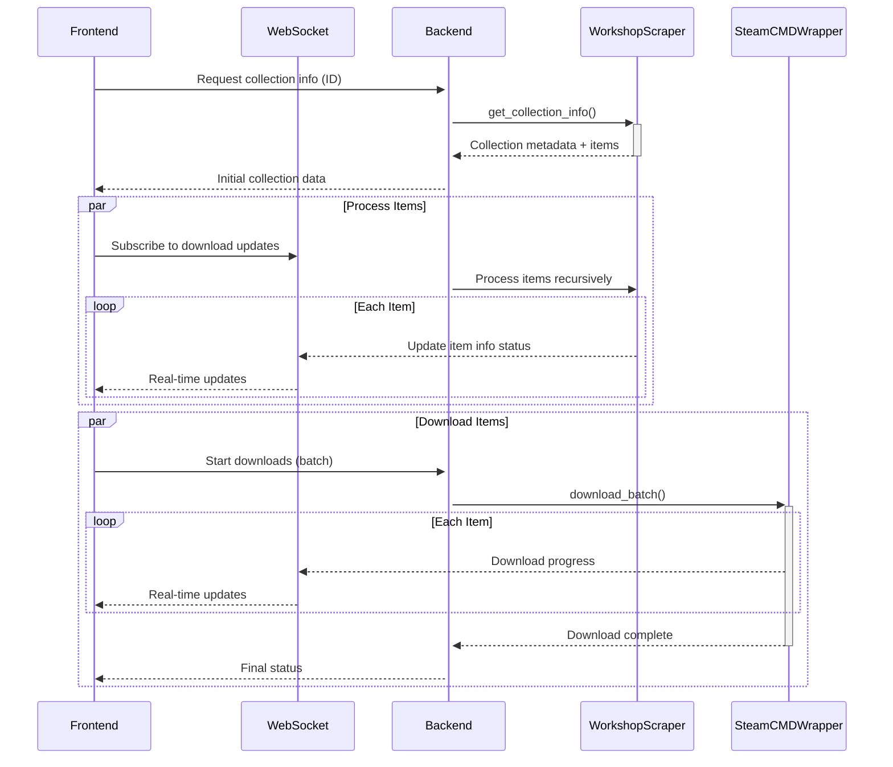

```mermaid
sequenceDiagram
  participant F as Frontend
  participant WS as WebSocket
  participant B as Backend
  participant SC as WorkshopScraper
  participant SW as SteamCMDWrapper

  F->>+B: Request collection info (ID)
  B->>+SC: get_collection_info()
  SC-->>-B: Collection metadata + items
  B-->>F: Initial collection data

  par Process Items
    F->>WS: Subscribe to download updates
    B->>SC: Process items recursively
    loop Each Item
      SC-->>WS: Update item info status
      WS-->>F: Real-time updates
    end
  end

  par Download Items
    F->>B: Start downloads (batch)
    B->>+SW: download_batch()
    loop Each Item
      SW-->>WS: Download progress
      WS-->>F: Real-time updates
    end
    SW-->>-B: Download complete
    B-->>F: Final status
  end
```
